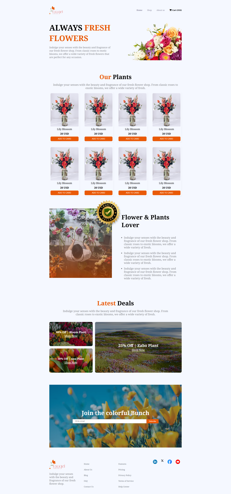

# Flower Market

A modern, responsive flower and plant shop landing page built with HTML and CSS.

## Features

- **Responsive Design:** Fully responsive for desktop, tablet, and mobile devices.
- **Modern UI:** Clean, attractive layout using Google Fonts and Font Awesome icons.
- **Product Cards:** Showcases multiple plant/flower cards with images, names, prices, and add-to-cart buttons.
- **Promotional Banner:** Eye-catching hero section with a call-to-action.
- **Deals Section:** Highlights latest deals with styled cards.
- **Newsletter Join:** Users can subscribe to the newsletter.
- **Accessible Footer:** Includes navigation and social links.

## Folder Structure

```
FlowerMarket/
│
├── assets/                # Images and icons
│   ├── logo.png
│   ├── hero-flower.png
│   ├── sample-flower-image.png
│   ├── flower-store.png
│   ├── trusted-badge-removebg-preview.png
│   ├── deal-bloom.png
│   ├── deal-ana.png
│   ├── deal-zabo.png
│   ├── news-letter-bg.png
│   ├── icon-linkedin.png
│   ├── icon-twitter.png
│   ├── icon-facebook.png
│   └── icon-youtube.png
│
├── index.html             # Main HTML file
├── style.css              # Main CSS file
└── README.md              # Project documentation
```

## Getting Started

1. **Clone or Download** this repository.
2. **Open `index.html`** in your browser to view the site.

## Customization

- Replace images in the `assets/` folder with your own.
- Edit `index.html` to change text, add more products, or update links.
- Modify `style.css` for further design customization.

## Dependencies

- [Google Fonts: Noto Serif](https://fonts.google.com/specimen/Noto+Serif)
- [Font Awesome](https://fontawesome.com/) (via CDN)

## Screenshots for Desktop 



##
## Screenshots for moible


##